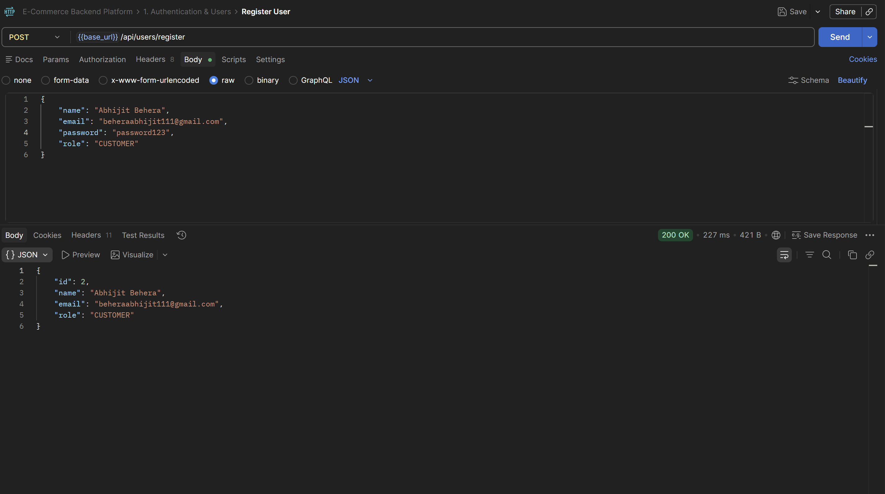
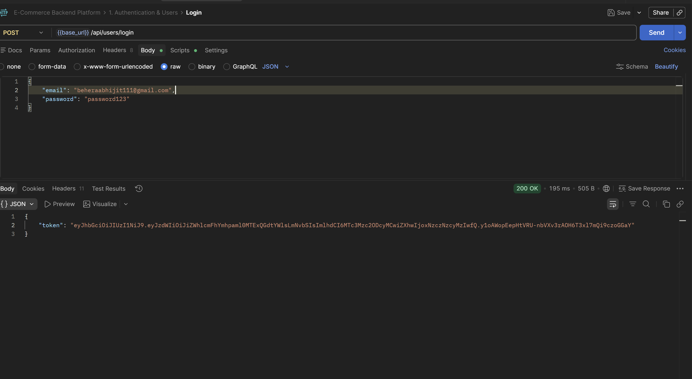
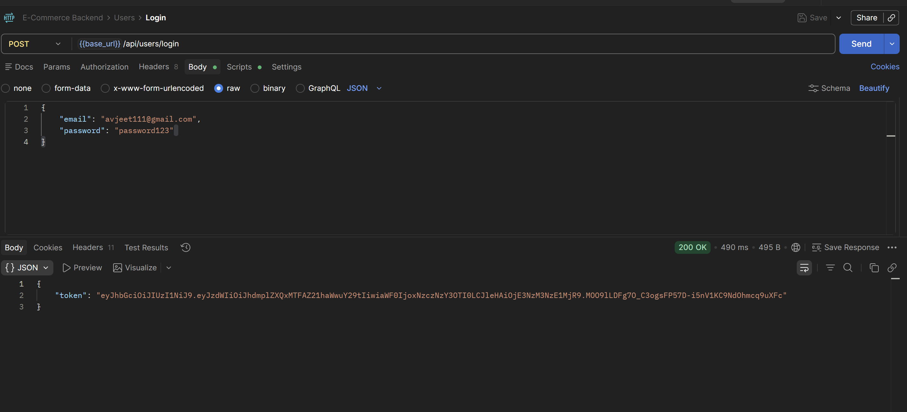
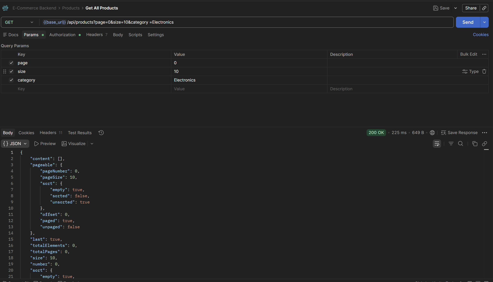
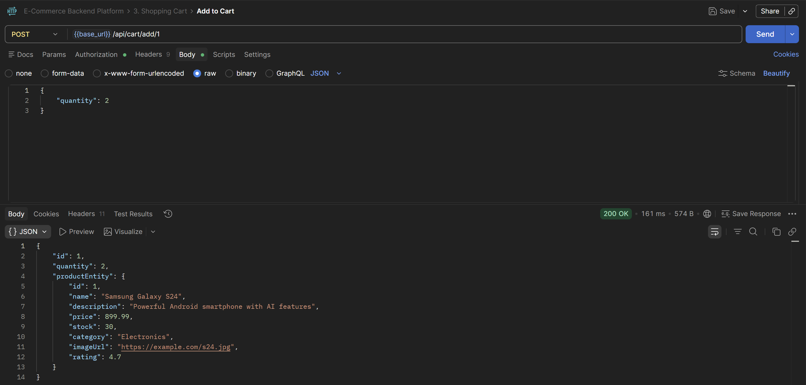
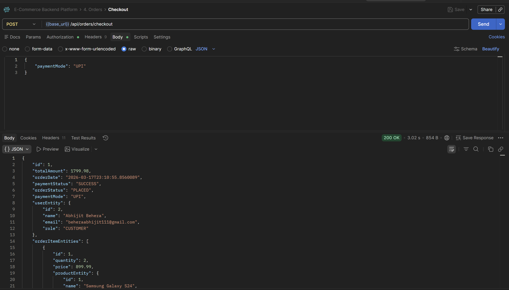
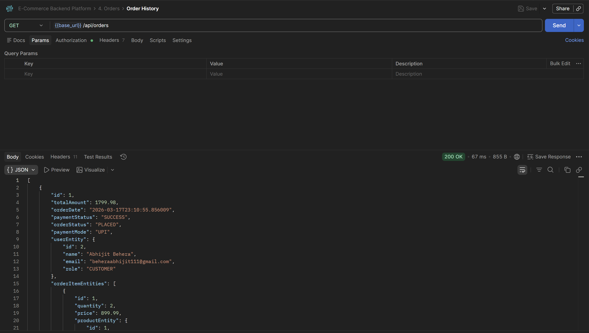
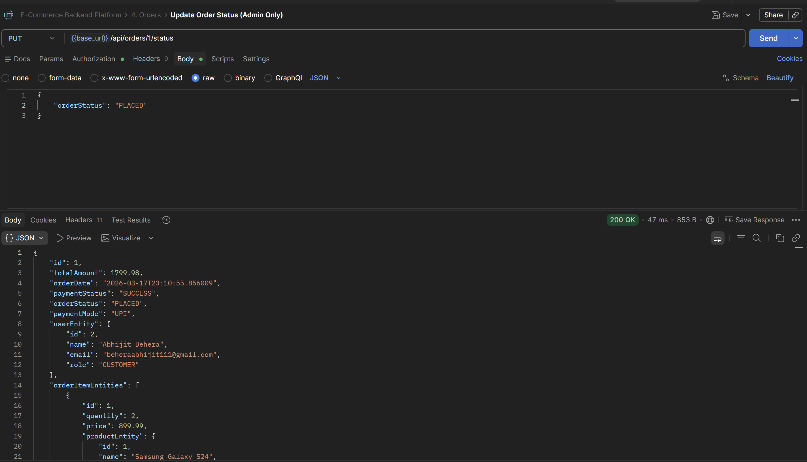

<h1 align="center">E-Commerce Backend Platform</h1>

<p align="center">
  A production-grade, scalable backend engine for a modern e-commerce platform. Built with a clean, layered architecture and featuring robust REST APIs.
</p>

## Table of Contents

- [Overview](#overview)
- [Features](#features)
- [Tech Stack](#tech-stack)
- [Project Structure](#project-structure)
- [Prerequisites](#prerequisites)
- [Getting Started](#getting-started)
  - [Clone the Repository](#1-clone-the-repository)
  - [Configure application.properties](#2-configure-applicationproperties)
  - [Run with Docker Compose](#3-run-with-docker-compose)
  - [Run Locally (Without Docker)](#4-run-locally-without-docker)
- [Database Schema](#database-schema)
  - [Entity-Relationship (ER) diagram](#1-entity-relationship-er-diagram)
  - [Table Structure](#2-table-structure)
  - [Useful SQL Commands](#3-useful-sql-commands)
- [API Documentation](#api-documentation)
  - [Authentication](#1-authentication)
  - [Roles](#2-roles)
  - [API Endpoint Authorization](#3-api-endpoint-authorization)
  - [User APIs](#4-user-apis)
  - [Product APIs](#5-product-apis)
  - [Cart APIs](#6-cart-apis)
  - [Order APIs](#7-order-apis)
- [Exception Handling](#exception-handling)
- [Logging Strategy](#logging-strategy)
- [Testing](#testing)
- [Swagger UI Documentation](#swagger-ui-documentation)

## Overview

**ECommerce Backend Platform** is a RESTful API-based production-ready engine designed to manage core operations of a digital storefront. Built using **Java 17** and **Spring Boot 3**, it acts as a scalable services layer intended for high-performance web or mobile clients.

The system handles the entire digital storefront lifecycle including stateless *JWT user authentication*, *dynamic product discovery*, *persistent shopping carts*, *order placement*, and *automated inventory tracking*.

Following industry-standard **layered architecture** (Controller → Service → Repository → Entity), the project utilizes DTOs with ModelMapper for clean data transfer, SLF4J for logging audit trails, and Swagger UI for interactive API documentation. The environment is fully containerized via Docker Compose for zero-config deployment.

## Features

| Feature | Description |
|---|---|
| JWT Authentication | Stateless security using Spring Security and JWT tokens |
| User Management | Account registration, secure login, and role-based access |
| Product Catalog | CRUD operations with category filtering and pagination |
| Cart Handling | Real-time shopping session management with price logic |
| Order Management | Seamless checkout with status tracking and history |
| Email Notifications | Integrated SMTP triggers for order confirmations |
| Inventory Tracking | Automated stock reduction upon successful checkout |
| Swagger UI | Interactive API documentation and testing interface |
| Docker Support | One-click deployment for both App and MySQL database |

## Tech Stack

| Layer | Technology |
|---|---|
| Language | Java 17 |
| Framework | Spring Boot 3.4 |
| Security | Spring Security 6, JWT |
| Database | MySQL 8.0 |
| ORM | Spring Data JPA / Hibernate |
| Logging | SLF4J / Logback |
| Email | Java Mail Sender (SMTP) |
| API Docs | SpringDoc OpenAPI 3 (Swagger UI) |
| Build Tool | Maven |
| Containerization | Docker, Docker Compose |
| Testing | JUnit 5, Mockito |

## Project Structure

```
ecommerce_backend/
├── src/
│   ├── main/
│   │   ├── java/com/incture/ecommerce_backend/
│   │   │   ├── config/                     # Security, Swagger and Bean configurations
│   │   │   ├── controller/                 # REST API Controllers
│   │   │   ├── dto/                        # Request and Response objects
│   │   │   ├── entity/                     # JPA Database Models
│   │   │   ├── exception/                  # Error responses and global handler
│   │   │   ├── repository/                 # Data access layer
│   │   │   ├── service/                    # Business logic and validations
│   │   │   └── utils/                      # Jwt utilities & security helpers
│   │   └── resources/
│   │       └── application.properties      # Central application configuration
│   └── test/
│       └── java/com/incture/ecommerce_backend/
│           ├── controller/                 # Integration tests for API endpoints
│           ├── repository/                 # Unit tests for data access
│           └── service/                    # Unit tests for core logic (Mockito)
├── target/
├── docker-compose.yml
├── Dockerfile
├── pom.xml
└── README.md
```

## Prerequisites

Before starting, ensure you have the following installed:

| Tool | Version | Notes |
|---|---|---|
| Java (JDK) | 17+ | Verify with `java -version` |
| Maven | 3.6+ | Verify with `mvn -version` |
| Docker Desktop | Latest | Required for containerized build |
| Postman | Latest | For manual API testing |

## Getting Started

### 1. Clone the Repository

```bash
git clone <your-repository-url>
cd ecommerce_backend
```

### 2. Configure application.properties

Update the configuration in `src/main/resources/application.properties`:

```env
# Database Configuration
spring.datasource.url=jdbc:mysql://localhost:3307/ecommerce_db
spring.datasource.username=root
spring.datasource.password=mysql123

# Email Notifications (SMTP)
spring.mail.username=your_email@gmail.com
spring.mail.password=your_app_password
```

### 3. Run with Docker Compose

This is the **recommended** way to launch both the application and MySQL:

```bash
docker compose up --build -d
```

- **App Access**: `http://localhost:8080`
- **Swagger Docs**: `http://localhost:8080/swagger-ui/index.html`

### 4. Run Locally (Without Docker)

Build the project:
```bash
mvn clean install
```

Start the application:
```bash
mvn spring-boot:run
```

## Database Schema

The system uses Hibernate to manage the schema and data integrity constraints.

### 1. Entity-Relationship (ER) diagram

```text
┌───────────────────────┐ 1               1 ┌───────────────────────┐
│         users         │───────────────────│         carts         │
├───────────────────────┤    (OneToOne)     ├───────────────────────┤
│ **id** (PK)           │                   │ **id** (PK)           │
│ name                  │                   │ user_id (FK)          │
│ email (UK)            │                   │ total_price           │
│ role                  │                   └──────────┬────────────┘
└──────────┬────────────┘                              │ 1
           │ 1                                         │
           │ (OneToMany)                               │ (OneToMany)
           │                                           │
           │ N                                         │ N
┌──────────▼────────────┐                   ┌──────────▼────────────┐
│        orders         │                   │      cart_items       │
├───────────────────────┤                   ├───────────────────────┤
│ **id** (PK)           │                   │ **id** (PK)           │
│ user_id (FK)          │                   │ cart_id (FK)          │
│ total_amount          │                   │ product_id (FK)       │
│ order_date            │                   │ quantity              │
│ order_status          │                   └──────────┬────────────┘
└──────────┬────────────┘                              │ N
           │ 1                                         │
           │ (OneToMany)                               │ (OneToMany)
           │                                           │
           │ N                                         │ 1
┌──────────▼────────────┐                   ┌──────────▼────────────┐
│      order_items      │ N               1 │       products        │
├───────────────────────┤───────────────────├───────────────────────┤
│ **id** (PK)           │    (OneToMany)    │ **id** (PK)           │
│ order_id (FK)         │                   │ name                  │
│ product_id (FK)       │                   │ description           │
│ price                 │                   │ price                 │
│ quantity              │                   │ stock                 │
└───────────────────────┘                   └───────────────────────┘
```

### 2. Table Structure

#### User Table
| Column | Type | Description |
|---|---|---|
| id | BIGINT (PK) | Auto-incremented ID |
| name | VARCHAR | User fullName |
| email | VARCHAR (UQ) | Primary ID for login |
| password | VARCHAR | BCrypt encoded hash |
| role | VARCHAR | Roles: ADMIN, CUSTOMER |

#### Product Table
| Column | Type | Description |
|---|---|---|
| id | BIGINT (PK) | Unique product id |
| name | VARCHAR | Display name |
| description | VARCHAR | Product summary |
| price | DOUBLE | Current selling price |
| stock | INT | Available quantity |
| category | VARCHAR | Product grouping |
| image_url | VARCHAR | Link to assets |
| rating | DOUBLE | Average user rating |

#### Orders Table
| Column | Type | Description |
|---|---|---|
| id | BIGINT (PK) | Unique order id |
| user_id | BIGINT (FK) | Reference to customer |
| total_amount | DOUBLE | Final purchase price |
| order_date | DATETIME | Timestamp of purchase |
| payment_status | VARCHAR | SUCCESS, PENDING, FAILED |
| order_status | VARCHAR | PLACED, SHIPPED, DELIVERED |
| payment_mode | VARCHAR | CREDIT_CARD, COD, UPI |

### 3. Useful SQL Commands
You can inspect the running system using these queries in your MySQL client:

```sql
USE ecommerce_db;
SELECT * FROM users;
SELECT * FROM products;
SELECT * FROM orders;
```

## API Documentation

### 1. Authentication
The API uses **Stateless JWT**. Secured endpoints require the header:
`Authorization: Bearer <your_jwt_token>`

### 2. Roles
- **CUSTOMER**: Can browse, manage personal cart, and place orders.
- **ADMIN**: Can manage catalog (CRUD), users, and update order statuses.

### 3. API Endpoint Authorization

| Method | Endpoint | Access Role | Description |
|---|---|---|---|
| POST | `/api/users/register` | Public | Register new account |
| POST | `/api/users/login` | Public | Authenticate & get JWT |
| GET | `/api/users` | ADMIN | List all registered users |
| POST | `/api/products` | ADMIN | Add new product |
| GET | `/api/products` | Any | List catalog with pagination |
| ALL | `/api/cart/**` | CUSTOMER | Full cart lifecycle |
| POST | `/api/orders/checkout`| CUSTOMER | Finalize purchase |

### 4. User APIs



> 💡 *Register users with unique emails. Use the login endpoint to generate a Bearer token for secured operations.*

### 5. Product APIs

> 💡 *Products support comprehensive filtering by category and price range, with server-side pagination.*

### 6. Cart APIs

> 💡 *Shopping Cart management includes adding items, updating quantities, and real-time total calculation.*

### 7. Order APIs



> 💡 *The checkout workflow handles payment modes, reduces inventory stock, and generates order history.*

## Exception Handling
The application uses a centralized global handler (`@RestControllerAdvice`) to translate server exceptions into clean JSON responses:
```json
{
  "message": "Resource not found with ID: 101",
  "status": 404
}
```

## Logging Strategy
We use **SLF4J** for application-level monitoring. Actions like user registration, inventory reduction, and SMTP triggers are logged to allow for reliable post-incident audits. Logs are configured to output to both console and file.

## Testing
Comprehensive test suite including:
- **Unit Tests**: Business logic in Services and Repository mocks.
- **Web layer Tests**: Verified via MockMvc with standalone setup to bypass secondary filters.
- **Repository Tests**: Validated using H2 in-memory profiles.

To execute the suite:
```bash
mvn test
```

## Swagger UI Documentation
To enhance developer experience and API consumption, this project integrates **SpringDoc OpenAPI 3 (Swagger UI)**. It provides a beautiful, interactive web interface to explore, test, and validate all REST endpoints directly from your browser—without needing external tools like Postman.

### Accessing the Documentation
👉 **`http://localhost:8080/swagger-ui/index.html`**

### Recommended Workflow for Testing:
1.  **Register/Login**: Use the `/api/users` endpoints to get a token.
2.  **Authorize**: Click the green "Authorize" button at the top and paste your token.
3.  **Interact**: Secured endpoints (marked with 🔒) will now be accessible based on your role.
